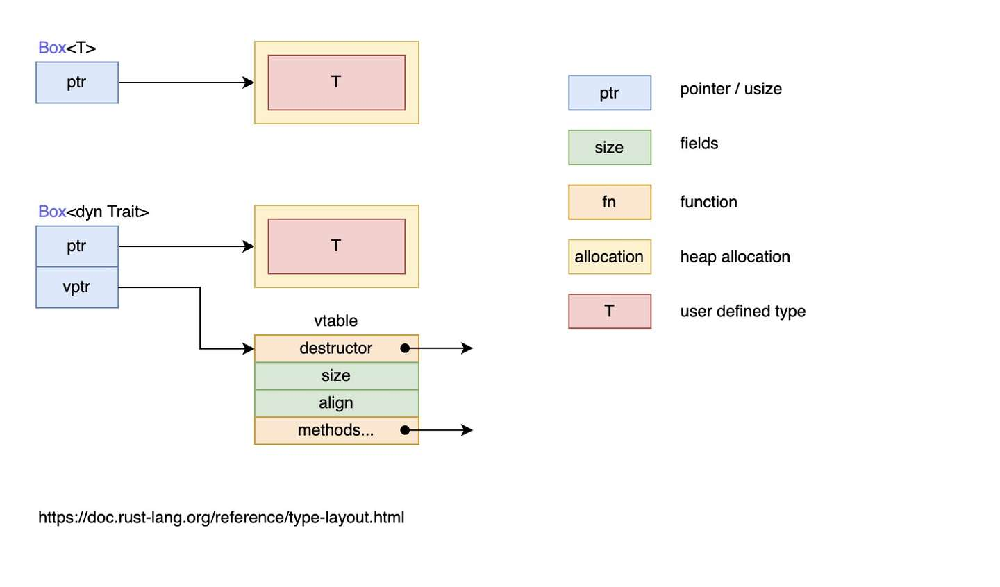

网络上能找到的的Rust面经整理

# Rust

## 语言理解

### 与C++的比较

#### Rust 相比 C++ 的好处

1. **内存安全**
   - Rust 通过所有权、借用、生命周期等机制，在编译时保证了内存安全；微软研究表明，70%的C/C++安全漏洞源于内存错误，而Rust可从根本上避免此类问题
   - C++依赖于程序员手动管理内存，容易出现内存泄漏、悬空指针等问题
2. **无畏并发**
   - Rust 编译期静态检查并发代码的安全性，避免数据竞争，`Tokio` 异步运行时凭借此特性支撑高并发网络服务
3. **零成本抽象**
   - Rust 的设计哲学之一是“零成本抽象”，即高级抽象（如迭代器、泛型、模式匹配）在运行时不会引入额外的性能开销，通过编译时严格的所有权和借用检查机制，彻底消除空指针、数据竞争等内存安全问题，无需依赖垃圾回收，使得在系统编程中表现卓越
   - 与 C++ 的模板元编程相比，Rust 的泛型和 trait 系统更加直观和安全，同时保持了高性能
4. 函数式编程风格
   - Rust 支持函数式编程范式，提供了闭包、迭代器、模式匹配等特性，使代码更加简洁、优雅，提高代码可读性，且在不牺牲性能的情况下实现高效抽象
5. 更好的错误处理
   - Rust 提供了 `Result` 和 `Option` 类型，强制程序员显式处理可能的错误和空值
   - 避免了 C++ 中常见的未处理异常或空指针问题
6. 跨平台一致性
   - Rust 的行为在不同平台上是一致的，且 `rustc` 严格遵循语言规范，大大减少了 UB
   - C++可能会因为编译器差异出现不一致，而且UB常见且难以调试
7. 强大的包管理工具
   - 内置 `Cargo`，可以轻松管理项目依赖、构建、测试
   - 与 C++ 的依赖管理（如手动或使用 `Cmake`等工具）相比，更见简单、方便
8. 客观的安全标准
   - Rust 的安全规则提供了一个客观的标准，可以明确区分 API 滥用和 API 本身的错误，编译器会明确指出问题的根源
   - 在 C/C++ 中，错误报告往往需要维护者确认某些行为是bug还是预期行为，沟通成本较高
9. 文档和测试一体化
   - Rust 的文档注释（`///`）和测试代码可以无缝集成到项目中
   - C++ 需要自己编写测试代码

#### Rust的各种特性（指针、数据结构等）在C++里对应什么？

| 特性             | C++                                            | Rust                                |
| :--------------- | :--------------------------------------------- | :---------------------------------- |
| **指针与引用**   | 原始指针 `int* ptr = &x`                       | 引用 `&T``&mut T`                   |
|                  | 独占所有权的智能指针  `std::unique_ptr<T>`     | 独占所有权的智能指针`Box<T>`        |
|                  | 共享所有权的智能指针 `std::shared_ptr<T>`      | 引用计数的智能指针`Rc<T>` `Arc<T>`  |
|                  | 不增加引用计数的弱引用 `std::weak_ptr<T>`      | 弱引用 `Weak<T>`                    |
| **数据结构**     | 动态数组`std::vector<T>`                       | 动态数组 `Vec<T>`                   |
|                  | 基于红黑树的有序映射 `std::map<K, V>`          | 基于B树的有序映射 `BTreeMap<K,V>`   |
|                  | 基于哈希表的无序映射 `std::unordered_map<K,V>` | 基于哈希表的无序映射 `HashMap<K,V>` |
|                  | 基于红黑树的有序集合 `std::set<T>`             | 基于B树的有序集合 `BTreeSet<T>`     |
|                  | 基于哈希表的无序集合 `std::unordered_set<T>`   | 基于哈希表的无序集合 `HashSet<T>`   |
| **并发与多线程** | `std::thread`、`std::mutex`                    | `std::thread`、`Mutex`              |
| **面向对象编程** | 抽象类                                         | `trait` 定义接口                    |
|                  | 多态                                           | `dyn trait` 动态分发                |
| **泛型与模板**   | `template<typename T>` 定义泛型函数或类        | `fn foo<T>(x: T)` 定义泛型函数      |

### Rust 语言本身

#### 用Rust获得安全的同时可能会影响效率，考虑效率优先还是安全优先？

1. Rust 的设计哲学是**零成本抽象**，即在保证安全性的同时，尽量不引入额外的运行时开销。然而，在某些情况下，为了追求更高的效率，可能需要放松一些安全约束
2. 在对性能要求比较高的场景中，可能需要优先考虑效率，如使用 `unsafe` 代码、使用内联汇编（`asm!` 宏）直接编写底层指令
3. 在大多数情况下，安全性仍是首要考虑的因素，尤其是它用来开发一些关键基础设施，如OS、区块链、金融系统等，安全性至关重要，而且项目长期维护，也可以减少潜在的bug

#### Rust 优势

- 内存安全，并发安全，无gc

#### Rust 常用的设计模式

#### Rust 程序有哪些 section，由什么组成？程序启动的过程？

1. 程序在编译后会生成一个二进制文件，该文件包含多个 **section**（段），是程序在内存中的逻辑分区，包括：
   - 代码段 `.txt`
     - 包含程序的机器指令（即编译后的代码）
   - 数据段
     - `.data`：**已初始化**的全局变量和静态变量
     - `.bss`：**未初始化**的全局变量和静态变量
     - `.rodata`：只读数据（如字符串常量）
   - 堆 （Heap）
     - 动态分配的内存区域，用于存储运行时分配的数据（如 `Box`、`Vec` 等）
   - 栈 （Stack）
     - 用于存储函数调用的局部变量、参数和返回地址
     - 栈是 LIFO（后进先出）结构，由编译器自动管理
   - 元数据段
     - **Rust 特有的 section**，包含程序的元信息，如 panic 处理函数、堆栈展开信息等
2. 一个典型的 Rust 程序由以下部分组成：
   - 入口函数 `main`
   - 依赖库 `crate`，通过 `Cargo.toml` 文件管理
   - 模块 `mod`，可以通过 `mod` 组织代码，可以嵌套
   - 全局变量，需要通过 `lazy_static` 或 `OnceCell` 等机制实现延迟初始化
3. 程序启动过程可以分为以下几个阶段：
   - 加载程序
     - 操作系统将程序的二进制文件加载到内存中
     - 解析程序的 section（如 `.text`、`.data`、`.bss` 等）
   - 初始化运行时
     - 设置堆栈、初始化全局变量等
     - Rust 的运行时（runtime）非常轻量，主要负责堆栈展开（unwinding）和 panic 处理
   - 调用 `main` 函数
     - `main` 是代码实际入口
   - 执行用户代码
     - 按逻辑执行
   - 程序结束
     - `main` 返回时，程序结束
     - 释放所有资源（如堆内存、文件句柄等）

#### 为何部分库强调支持 `no_std` 环境？

1. **应用场景**：

   - **嵌入式开发**：无操作系统环境（如ARM Cortex-M）

   - **内核开发**：操作系统内核等特权环境

   - **极致优化**：避免标准库开销（如WASM微服务）


2. **限制与解决方案**：

   - 无堆分配 → 使用`alloc` crate+自定义全局分配器

   - 无线程 → 基于中断的并发模型

   - 无文件系统 → 实现`Read/Write` trait对接硬件

#### **为何不启用 Cargo 依赖的全部功能？Rust 的未用代码清除机制是否足够？**

1. **禁用全特性的原因**：
   - **编译时间**：未用特性仍可能导致额外编译
   - **依赖冲突**：不同特性可能引入不兼容的依赖版本
   - **条件控制**：通过`cfg`精细控制平台特定代码

2. **Rust的未用代码清除**：

   - 虽然会消除未使用的函数（dead code elimination）

   - 但泛型实例化和宏展开仍可能引入冗余代码

## 基本类型

### 数值

### 字符、布尔、单元

### 语句与表达式

### 函数

## 复合类型

### 字符串与切片

#### `&str` 与 `String`

- `&str`：
  - 字符串字面量，在编译期就固定，所以是指向了程序二进制可执行文件中的某一处
  - 是 `str` 的**不可变**引用，快速且高效
  - 使用 UTF-8 编码
- `String`
  - 在堆上分配编译时位置大小的内存，可增长、可改变且具有所有权
  - 在程序运行时需要：
    - 向OS请求内存来存放 `String` 对象
    - 在使用完成后，将内存释放，还给OS
  - 不可以用下标操作，要么用 `.chars()`，要么用 `.bytes()`
  - 使用 UTF-8 编码

#### 为何选择使用 `str` 而非 `String`？

1. **轻量**
   - `str` 不存储容量等额外元数据，作为引用传递时仅涉及指针和长度，零开销传递
   - `String` 需要存储容量、长度、堆指针，完整克隆需要堆内存复制
2. **不可变**
   - 不可变借用，多个线程可同时读取同一 `&str` 无需同步
3. **栈分配 vs 堆分配**
   - `&str` 存在栈上，而 `String` 总是需要堆分配

### 元组

### 结构体

### 枚举

### 数组

### 动态数组 `vector`

### KV存储 `HashMap`

## 深入类型

### 类型转换、类型别名

### `Sized` 和DST

#### `Sized` 的含义

- 用于表示一个类型的大小在编译时已知且固定，即所有在编译时能计算出确切的内存大小的类型，才会实现 `Sized` trait
- 所有在 Rust 中的类型默认都会实现 `Sized`，除非显式地标记为不实现 `Sized`（例如，某些类型如切片、动态大小类型DST等）
- 通常不需要手动实现 `Sized`
- 没有实现 `Sized` trait 的类型无法直接作为普通的值使用，必须通过引用 `&`来处理
- `?Sized` 表示一个泛型类型可以是**动态大小类型**

## 所有权和借用

### 所有权

#### 管理内存的方式

1. **垃圾回收机制**（GC）：在程序运行时不断寻找不再使用的内存，典型代表：Java、Go
2. **手动管理内存的分配和释放**：在程序中，通过函数调用的方式来申请和释放内存，典型代表：C++
3. **所有权管理内存**：编译器在编译时会根据一系列规则进行检查，这种检查只发生在编译期，因此对于程序运行期，不会有任何性能上的损失，典型代表：Rust
   - Rust的所有权规则：
     - 每一个值都被一个变量所拥有，该变量被称为值的所有者
     - 一个值同时只能被一个变量所拥有，或者说一个值只能拥有一个所有者
     - 当所有者（变量）离开作用域范围时，这个值将被丢弃(drop)

#### 堆和栈

- **栈**
  - 内存从高位地址向下增长，栈内存连续分配
  - Rust中 `main` 线程的栈大小是8MB，普通线程是2MB
  - 函数调用时会在栈中创建临时栈空间，调用结束后栈空间中的对象自动进入 `Drop` 流程，最后栈顶指针自动移动到上一个调用栈顶
  - 性能往往更高，但不绝对
- **堆**
  - 内存从低位地址向上增长，堆内存通常只受物理内存限制，通常不连续
  - Rust堆上对象都拥有一个所有者
  - 赋值发生的是所有权的转移（只需浅拷贝栈上的引用或智能指针即可），堆中内容不变
- **性能问题**
  - 小型数据，在栈上的分配性能和读取性能都要比堆上高
  - 中型数据，栈上分配性能高，但是读取性能和堆上并无区别，因为无法利用寄存器或 CPU 高速缓存，最终还是要经过一次内存寻址
  - 大型数据，只建议在堆上分配和使用

#### 怎么判断数据分配在栈上还是分配在堆上?

- Rust 的内存管理模型非常清晰，所以分配在哪里取决于数据的类型和创建方式
- 栈上分配的数据：
  - 基本数据类型：如 `i32`, `f64`, `bool`等
  - **固定大小**的复合类型：元组、数组、结构体等
  - 函数内部局部变量
- 堆上分配的数据：
  - **动态大小**的类型：如 `String`, `Vec<T>`, `Box<T>` 等
  - 智能指针管理的数据：如 `Box<T>`, `Rc<T>`, `Arc<T>`等

#### 深拷贝与浅拷贝

- 深拷贝（克隆）
  - 任何**自动**的复制都不是深拷贝
  - 深度复制**堆**上的数据，而不仅仅是栈上的数据
  - 使用 `clone` 是深拷贝
  - 性能较差
- 浅拷贝（拷贝）
  - 只发生在**栈**上
  - 性能很高
  - `Copy` trait 实现的是浅拷贝
  - =所有权的转移

### 引用与借用

#### 定义

| 概念         | 引用(Reference)                 | 借用(Borrowing)                  |
| :----------- | :------------------------------ | :------------------------------- |
| **表现形式** | 具体的指针类型（`&T`/`&mut T`） | 语言层面的抽象规则               |
| **关注点**   | 内存访问方式                    | 所有权临时转移的约束规则         |
| **语法实体** | 是具体的Rust类型                | 是编译器的静态检查规则           |
| **生命周期** | 显式或隐式携带生命周期标注      | 通过借用检查器验证生命周期有效性 |

#### 为何倾向于使用 `AsRef<T>` 而非 `&[T]`？

1. **接口通用性**：`AsRef<T>` 可以接受任何能转换为 `&T` 的类型，包括 `String`, `Vec<T>`, `&str` 等，而 `&[T]` 只能切片引用
2. **所有权要求**：`AsRef<T>` 无特殊要求，而 `&[T]` 要求调用者必须已有切片引用

```rust
// 例子
fn process_path<P: AsRef<Path>>(path: P) {
    let path = path.as_ref();
    // 统一处理所有路径类型
}

// 可接受多种参数形式
process_path("a.txt");      // &str
process_path(String::from("b.txt")); // String
process_path(PathBuf::from("c.txt")); // PathBuf
```


## 模式匹配

### `match` 和 `if let`

### 解构 `Option`

### 模式适用场景

### 全模式列表

## 泛型和特征

### 泛型

泛型是零成本抽象，获得了巨大的性能，但损失了编译速度和二进制可运行文件的大小。Rust 在编译时进行泛型代码的**单态化**，这正是运行时高效的原因。

#### 为何在泛型函数中优先实现 `From<T>` trait 而非直接接受 `T` 参数？

1. **多源转换支持**：前者更具有扩展性优势，通过实现多个 `From` 变体支持多种输入类型
2. **错误处理统一**：`From` trait天然与 `?` 操作符协同工作
3. **类型推导友好**：编译器能自动推断转换路径


1. 
2. 为何 Default trait 对泛型结构体的 #[derive(Default)] 有特殊要求？（自动派生条件、字段类型约束的传播）
3. 为何 serde 库的 deserialize 函数常返回 Result<T, E> 而非直接 T？（错误处理的必要性、部分解析与回滚机制）

### 特征

特征定义了一组可以被共享的行为，只要实现了特征，就能使用这组行为

#### 孤儿规则

如果想要为类型 `A` 实现特征 `T`，那么 `A` 或者 `T` 至少有一个是在当前作用域中定义的，比如不可以为 `Vector` 类型实现 `Display` 特征，因为它们都定义在标准库中

要绕过孤儿规则，可以使用 `newtype` 模式，从而为外部类型实现外部特征，比如要为 `Vector` 实现 `Display`：

```rust
use std::fmt;

struct Wrapper(Vec<String>);

impl fmt::Display for Wrapper {
    fn fmt(&self, f: &mut fmt::Formatter) -> fmt::Result {
        write!(f, "[{}]", self.0.join(", "))
    }
}

fn main() {
    let w = Wrapper(vec![String::from("hello"), String::from("world")]);
    println!("w = {}", w);
}
```

简而言之就是为一个元组结构体创建新类型，该元组结构体封装有一个字段，该字段就是希望实现特征的具体类型

#### 常用 trait 有哪些？

| Trait 名称           | 用途                                                         | 如何使用                                                     |
| -------------------- | ------------------------------------------------------------ | ------------------------------------------------------------ |
| `Copy`               | 允许按位复制类型的值                                         | 添加 `#[derive(Copy)]`                                       |
| `Clone`              | 允许显式复制类型的值                                         | 添加 `#[derive(Clone)]` 或手动实现 `clone` 方法              |
| `Eq`                 | 表示类型可以进行相等性比较                                   | 添加 `#[derive(Eq)]` 或手动实现 `eq` 方法                    |
| `PartialEq`          | 表示类型可以进行部分相等性比较                               | 添加 `#[derive(PartialEq)]` 或手动实现 `partial_eq` 方法     |
| `Ord`                | 表示类型可以进行全序比较                                     | 添加 `#[derive(Ord)]` 或手动实现 `cmp` 方法                  |
| `PartialOrd`         | 表示类型可以进行部分序比较                                   | 添加 `#[derive(PartialOrd)]` 或手动实现 `partial_cmp` 方法   |
| `Debug`              | 允许格式化输出调试信息                                       | 添加 `#[derive(Debug)]` 或手动实现 `fmt` 方法                |
| `Default`            | 允许为类型创建默认值                                         | 在类型定义上添加 `#[derive(Default)]` 或手动实现 `default` 方法 |
| `Hash`               | 允许将类型的值用作哈希表的键                                 | 在类型定义上添加 `#[derive(Hash)]` 或手动实现 `hash` 方法    |
| `Display`            | 允许格式化输出用户面向的信息                                 | 手动实现 `fmt` 方法                                          |
| `FromStr`            | 允许从字符串解析出类型的值                                   | 手动实现 `from_str` 方法                                     |
| `From`/`Into`        | 允许在不同类型之间转换值                                     | 手动实现 `from` 或者 `into` 方法                             |
| `AsRef`/`AsMut`      | 允许将值转换为引用或可变引用                                 | 手动实现 `as_ref` 或者 `as_mut` 方法                         |
| `Borrow`/`BorrowMut` | 允许将值借用为引用或可变引用，通常用于哈希表的键和集合元素的比较和查找 | 手动实现 `borrow` 或者 `borrow_mut` 方法                     |
| `Deref`/`DerefMut`   | 允许重载解引用运算符（*）以便自定义解引用行为。通常用于智能指针 | 手动实现 `deref` 或 `deref_mut` 方法                         |
| `Iterator`           | 表示一个迭代器，可以迭代产生一系列值，通常用于 for 循环和其他迭代操作。 | 手动实现 `next` 方法                                         |
| `Any`                | 允许在运行时进行有限的类型反射和动态类型处理，仅适用于 `'static'` 生命周期 |                                                              |

#### `Copy` 和 `Clone` 的区别？

- 共同点：两者都是用于进行值的复制的trait，`Copy` 是 `Clone` 的一个特例——所有实现了 `Copy` 的类型也会实现 `Clone`，但是反之则不成立。
- 不同点：

| 特征       | `Copy`                                                       | `Clone`                                                      |
| ---------- | ------------------------------------------------------------ | ------------------------------------------------------------ |
| 语义       | 简单的按位复制                                               | 深拷贝，通常会**在堆上分配新的内存并复制数据**               |
| 适用类型   | 基本类型，如整数、浮点数、布尔值等，通常**不涉及堆内存**     | 需要进行深度复制的类型，如 `String`、`Vec<T>`                |
| 自动化程度 | **自动复制**，无需显式调用方法                               | 需要**显式调用** `.clone()` 方法                             |
| 性能       | **高效**，**不涉及资源管理**（没有复杂、额外的内存分配、资源释放操作） | **相对较慢**，可能涉及堆内存分配和复制                       |
| 例子       | `i32`, `f64`, `char`, `[i32; 3]` 等，当一个类型实现了 `Copy` 特征时，可以直接对它进行赋值，或者通过传递参数时“复制”值，而不需要显式调用 `clone` 方法 | `String`, `Vec<T>`, `Box<T>`, `Rc<T>` 等，通过 `Clone`，类型的实例会创建一个新的副本 |

- **为何 `#[derive(Clone)]` 对包含引用的结构体可能产生误导？如何手动实现？**

  - 由于Rust严格的所有权系统和内存安全保证，`Clone` trait 的自动派生对于包含引用的结构体会产生一些微妙的语义问题：

    - 当结构体包含引用时，`#[derive(Clone)]` 只会复制引用本身（即指针），不复制引用指向的数据
    - 自动派生的 `Clone` 实现会保留原始生命周期约束，可能导致不必要的限制

  - 手动实现解决方案：

    - 当需要真正的值拷贝而非指针拷贝时，应手动实现：

      ```rust
      #[derive(Clone)]
      struct ProperDeepCopy {
          data: String,  // 直接拥有数据
      }
      
      // 或者使用智能指针
      struct RefDeepCopy<'a> {
          data: Arc<&'a str>,  // 通过Arc共享
      }
      
      impl<'a> Clone for RefDeepCopy<'a> {
          fn clone(&self) -> Self {
              Self {
                  data: self.data.clone(),  // 增加引用计数
              }
          }
      }
      ```

    - 对于包含引用和自有数据的复合结构：

      ```rust
      struct MixedData<'a> {
          owned: Vec<u8>,
          borrowed: &'a [u8],
      }
      
      impl<'a> Clone for MixedData<'a> {
          fn clone(&self) -> Self {
              Self {
                  owned: self.owned.clone(),    // 深拷贝Vec
                  borrowed: self.borrowed,      // 浅拷贝引用
              }
          }
      }
      ```

    - 生命周期处理

      ```rust
      struct Flexible<'a, 'b> {
          a: &'a str,
          b: &'b [u8],
      }
      
      impl<'a, 'b> Clone for Flexible<'a, 'b> {
          fn clone(&self) -> Self {
              Self {
                  a: self.a,
                  b: self.b,
              }
          }
      }
      // 若涉及嵌套引用
      struct Complex<'a, T: 'a> {
          data: &'a T,
          marker: std::marker::PhantomData<&'a T>,
      }
      
      impl<'a, T> Clone for Complex<'a, T> {
          fn clone(&self) -> Self {
              Self {
                  data: self.data,
                  marker: std::marker::PhantomData,
              }
          }
      }
      ```

#### 为何 `Iterator::collect` 依赖 `FromIterator` trait 而非直接构造容器？

```rust
let nums = vec![1, 2, 3];
let set: HashSet<_> = nums.into_iter().collect(); // 依赖FromIterator
```

1. **容器无关性**：同一迭代器可生成`Vec`/`HashSet`等
2. **惰性构造**：迭代过程中逐步构建容器
3. **零成本抽象**：编译后等价于手写构造代码

#### 为何 `impl` Trait 在返回位置与参数位置的行为不同？何时选择泛型？

本质区别：

1. **参数位置**：语法糖，等价于泛型参数

   ```rust
   fn foo(arg: impl Debug) {} 
   // 等价于
   fn foo<D: Debug>(arg: D) {}
   // D:Debug称为特征约束
   ```

2. **返回位置**：存在类型擦除，实际返回具体实现的匿名类型

   在一种场景下非常有用，那就是返回的真是类型非常复杂，不知道该怎么声明，而Rust又要求必须标出所有的类型，此时就可以用 `impl Trait` 的方式简单返回

   但这种返回值方式有限制，只能返回一个具体的类型，如果有两个具体类型都实现了 `Iterator` 特征，也不能在 `if` 中返回A而在 `else` 中返回B，想要返回不同类型的话需要用特征对象

   ```rust
   fn bar() -> impl Iterator { it }
   // 返回一个实现了Iterator特征的类型，也就是迭代器
   ```

选择策略：

| 场景             | 推荐方式           | 原因                     |
| :--------------- | :----------------- | :----------------------- |
| 需要多种输入类型 | 参数位置impl Trait | 保持调用灵活性           |
| 返回闭包或迭代器 | 返回位置impl Trait | 避免暴露复杂的具体类型   |
| 需要静态分发     | 泛型参数           | 允许针对不同类型特化实现 |
| 需要动态分发     | trait对象          | 运行时多态场景           |

性能影响：

- 静态分发（泛型/`impl` Trait参数）：编译时生成特化代码，零运行时开销
- 动态分发（trait对象）：需要虚表查找，但有更好的代码体积控制

### 特征对象

需要在运行时从 `vtable` 动态查找需要调用的方法

#### `dyn` 关键字

- 只用在特征对象的类型声明上，在创建时无需使用 `dyn`
- 不能单独作为特征对象的定义，比如 `fn draw(x: dyn Draw){...}` 会报错，因为特征对象可能是任意实现了某个特征的类型，编译器在编译期不知道该类型的大小，而 `&dyn` 和 `Box<dyn>` 在编译期都是已知大小，所以可以用作特征对象的定义

#### 鸭子类型

- duck typing
- 只关心值长啥样，而不关心它实际是什么。当一个东西走起来像鸭子，叫起来像鸭子，那么它就是一只鸭子，就算它实际上是一个奥特曼，也不重要，我们就当它是鸭子
- 使用特征对象和 Rust 类型系统来进行类似鸭子类型操作的优势是：无需在运行时检查一个值是否实现了特定方法或者担心在调用时因为值没有实现方法而产生错误。如果值没有实现特征对象所需的特征， 那么 Rust 根本就不会编译

#### 什么时候要使用特征对象

- 以下两段代码分别是使用特征对象和使用泛型+特征约束：

  ```rust
  // 使用特征对象
  pub struct Screen {
      pub components: Vec<Box<dyn Draw>>,
  }
  
  
  impl Screen {
      pub fn run(&self) {
          for component in self.components.iter() {
              component.draw();
          }
      }
  }
  // components里面可以存A，B，C...只要它们实现了Draw trait
  ```

  ```rust
  // 使用泛型+特征约束
  pub struct Screen<T: Draw> {
      pub components: Vec<T>,
  }
  
  impl<T> Screen<T>
      where T: Draw {
      pub fn run(&self) {
          for component in self.components.iter() {
              component.draw();
          }
      }
  }
  // 这种写法限制了Screen实例的Vec<T>中的每个元素必须全是A或全是B
  ```

  - 综上，如果只需要相同类型的集合，更倾向于采用泛型+特征约束，因为实现更清晰，而且性能更好，在异构集合处理的时候可以用动态分发
  - 建议混合使用，以静态分发为主尤其是热点路径

#### 动态分发与静态分发

1. **静态分发**

   - 泛型是在**编译期**完成处理的，编译器为每一个泛型参数对应的具体类型生成一份代码
   - 对运行期性能完全没有影响
   - 虽然代码膨胀、但是对优化友好

2. **动态分发**

   - 直到**运行时**才能确定需要调用什么方法，即运行时多态，通过虚表查找实际方法
   - 有固定开销是每次调用需额外指针跳转，还有内存访问可能引起缓存未命中带来的更多开销
   - 类型擦除，运行时丢失具体类型信息
   - 代码体积稳定

   

   - 虽然特征对象没有固定大小，但它的引用类型如 `&dyn Draw`、`Box<dyn Draw>` 大小是固定为两个指针大小的
     - `ptr` 指向实现了特征 `T` 的具体类型的实例
     - `vptr` 指向一个虚表 `vtable`，其中保存了类型的实力对于可以调用的实现于特征 `Draw` 的方法，当调用方法时，直接从 `vtable` 中找到方法并调用
     - 比如，类型 `A` 实现了特征 `T`，类型 `A` 的实例对象 `a` 可以当作特征 `T` 的特征对象类型来使用，`a` 中保存了作为特征对象的数据指针（指向类型 `A` 的实例数据）和行为指针（指向 `vtable`）。此时的 `a` 是 `T` 的特征对象的实例，而不再是具体类型 `A` 的实例，而且 `a` 的 `vtable` 只包含了实现自特征 `T` 的那些方法（比如 `t`），因此 `a` 只能调用实现于特征 `T` 的 `t` 方法，而不能调用类型 `A` 本身实现的方法和类型 `A` 实现于其他特征的方法。**也就是说，`a` 是哪个特征对象的实例，它的 `vtable` 中就包含了该特征的方法。**

#### `Self` 与 `self`

1. `Self`：指代特征或方法类型的别名   
2. `self`：当前实例对象

#### 特征对象的限制

不是所有特征都能拥有特征对象，只有对象**安全的特征**才行，当一个特征的**所有方法**都有如下属性时，它的对象才是安全的：

1. 方法的返回类型不能是 `Self`
2. 方法没有任何泛型参数

比如 `Clone` 不是一个对象安全的特征，所以如果这样写会报错：

```rust
pub struct Screen {
    pub components: Vec<Box<dyn Clone>>,
}
```

#### 关联类型

1. **什么是关联类型？**

   关联类型是在特征定义的语句块中，声明一个自定义类型，这样就可以在特征的方法签名中使用该类型。比如标准库中的迭代器特征 `Iterator`有一个 `Item` 关联类型，用于替代遍历的值的类型：

   ```rust
   pub trait Iterator {
       type Item;
       fn next(&mut self) -> Option<Self::Item>;
   }
   // Self::Item指代类型实现中定义的Item类型，比如下面的Self::Item就表示u32:
   impl Iterator for Counter {
       type Item = u32;
       fn next(&mut self) -> Option<Self::Item> {
           // --snip--
       }
   }
   ```

2. 举例说明在自定义 trait 中定义并使用关联类型（associated type）的**具体场景及方式**

   - 使用关联类型而不用泛型主要是为了可读性，使用泛型的话需要在trait所有地方（比如函数头部）都写很多 `<T>`，类型定义复杂时更麻烦

     ```rust
     // 用关联类型
     pub trait Iterator {
         type Item;
         fn next(&mut self) -> Option<Self::Item>;
     }
     // 用泛型
     pub trait Iterator<Item> {
         fn next(&mut self) -> Option<Item>;
     }
     ```

     ```rust
     // 用关联类型
     trait Container{
         type A;
         type B;
         fn contains(&self, a: &Self::A, b: &Self::B) -> bool;
     }
     fn difference<C: Container>(container: &C) {}
     // 用泛型
     trait Container<A,B> {
         fn contains(&self,a: A,b: B) -> bool;
     }
     fn difference<A,B,C>(container: &C) -> i32
       where
         C : Container<A,B> {...}
     ```

   - 特别适合构建灵活且类型安全的**泛型容器**，用作类型抽象

     ```rust
     // 迭代器
     trait Container {
         type Item;  // 关联类型声明
         
         fn get(&self, index: usize) -> Option<&Self::Item>;
         fn push(&mut self, item: Self::Item);
         fn iter(&self) -> Iter<'_, Self::Item>;  // 使用关联类型
     }
     
     struct MyVec<T> {
         data: Vec<T>,
     }
     
     impl<T> Container for MyVec<T> {
         type Item = T;  // 关联类型具体化
         
         fn get(&self, index: usize) -> Option<&T> {
             self.data.get(index)
         }
         
         fn push(&mut self, item: T) {
             self.data.push(item);
         }
         
         fn iter(&self) -> std::slice::Iter<'_, T> {
             self.data.iter()
         }
     }
     ```

     ```rust
     // 图结构
     trait Graph {
         type Node: Hash + Eq;  // 带trait约束的关联类型
         type Edge;
         type NodeIter: Iterator<Item = Self::Node>;
         type EdgeIter: Iterator<Item = Self::Edge>;
         
         fn nodes(&self) -> Self::NodeIter;
         fn edges(&self, node: &Self::Node) -> Self::EdgeIter;
     }
     ```

3. **默认类型参数**

   - 主要作用：
     1. 减少实现的样板代码
     2. 扩展类型但是无需大幅修改现有的代码

   - 用的比较少


## 生命周期

### 简介

1. 概念：简单理解就是引用的有效作用域
2. 主要作用：避免悬垂引用
3. rust使用**借用检查器**来检查借用正确性，不允许借用生命周期更短的变量 
4. 存在多个引用时，编译器有时会无法自动推导生命周期，于是需要手动标注，不过标注并不会改变任何引用的实际作用域

### 生命周期消除

实际上对于编译器来说，每一个引用类型都有一个生命周期，但是有消除规则，所以不用每个引用都标注生命周期，比如：

```rust
fn first_word(s: &str) -> &str {
    let bytes = s.as_bytes();

    for (i, &item) in bytes.iter().enumerate() {
        if item == b' ' {
            return &s[0..i];
        }
    }

    &s[..]
}
```

因为函数的返回值是一个引用类型，对于引用只有两种情况：

1. 从参数获取
2. 从函数体内部新创建的变量获取（悬垂引用）

只能是情况1，而且也只有一个传入参数，编译器自动判定输入生命周期==输出生命周期，所以自然可以编译通过

三条消除规则：

- **每一个引用参数都会获得独自的生命周期**

  例如一个引用参数的函数就有一个生命周期标注: `fn foo<'a>(x: &'a i32)`，两个引用参数的有两个生命周期标注:`fn foo<'a, 'b>(x: &'a i32, y: &'b i32)`, 依此类推

- **若只有一个输入生命周期（函数参数中只有一个引用类型），那么该生命周期会被赋给所有的输出生命周期**，也就是所有返回值的生命周期都等于该输入生命周期

  例如函数 `fn foo(x: &i32) -> &i32`，`x` 参数的生命周期会被自动赋给返回值 `&i32`，因此该函数等同于 `fn foo<'a>(x: &'a i32) -> &'a i32`

- **若存在多个输入生命周期，且其中一个是 `&self` 或 `&mut self`，则 `&self` 的生命周期被赋给所有的输出生命周期**

  拥有 `&self` 形式的参数，说明该函数是一个 `方法`，该规则让方法的使用便利度大幅提升

### 静态生命周期

`'static` 表示引用可以和整个程序获得一样久，比如字符串字面量和特征对象

- `&'static`

  - 一个**引用**必须要活得跟剩下的程序一样久，才能被标注为 `&'static`，注意针对的仅仅是引用，而不是持有该引用的变量，对于变量来说，还是要遵循相应的作用域规则：

    ```rust
    n get_memory_location() -> (usize, usize) {
      // “Hello World” 是字符串字面量，因此它的生命周期是 `'static`.
      // 但持有它的变量 `string` 的生命周期就不一样了，它完全取决于变量作用域，对于该例子来说，也就是当前的函数范围
      let string = "Hello World!";
      let pointer = string.as_ptr() as usize;
      let length = string.len();
      (pointer, length)
      // `string` 在这里被 drop 释放
      // 虽然变量被释放，无法再被访问，但是数据依然还会继续存活
    }
    
    fn get_str_at_location(pointer: usize, length: usize) -> &'static str {
      // 使用裸指针需要 `unsafe{}` 语句块
      // 引用确实活得和程序一样久，因为这里可以直接取到对应字符串
      unsafe { from_utf8_unchecked(from_raw_parts(pointer as *const u8, length)) }
    }
    
    fn main() {
      let (pointer, length) = get_memory_location();
      let message = get_str_at_location(pointer, length);
      println!(
        "The {} bytes at 0x{:X} stored: {}",
        length, pointer, message
      );
      // 如果大家想知道为何处理裸指针需要 `unsafe`，可以试着反注释以下代码
      // let message = get_str_at_location(1000, 10);
    }
    ```

- `T:'static`

  - 在函数中，可能会约束 `T:'static`，即 `T` 必须活得和程序一样久，那么使用 `T` 的时候就必须要满足 `'static` 约束，但是使用 `&T` 的话只要确保 `&T` 的生命周期符合规则即可，不用非要 `'static`
  - **`<T: 'static>`意味着`T`是全局变量/常量吗？**
    - 不是，它的含义仅仅是 `T` 的生命周期是 `'static`，即生命周期足够长，可以持续到程序的整个运行期间

### 生命周期约束

通过形如 `'a:'b` 的语法，说明两个生命周期的长短关系，这个是表示 `'a` 活得至少和 `'b` 一样久。

`T:'a` 表示类型 `T` 必须比 `'a` 获得要久

### 为何需显式定义接收两个引用并返回值的作用域函数模板，即使编译能通过？

```rust
// 显式标注版（推荐）
fn longest<'a>(s1: &'a str, s2: &'a str) -> &'a str {
    if s1.len() > s2.len() { s1 } else { s2 }
}

// 隐式推断版（不推荐）
fn longest(s1: &str, s2: &str) -> &str { /* ... */ }
```

- **类型安全**：明确约束输入输出的生命周期关系
- **可读性**：作为API契约的一部分，帮助调用者理解约束
- **未来兼容**：避免编译器推断策略变化导致代码break

### 如何利用生命周期为引用切片（涉及两个不同生命周期）定义迭代器？

```rust
struct SliceIter<'a, 'b: 'a, T> {
    first: &'a [T],
    second: &'b [T],
    index: usize,
}

impl<'a, 'b, T> Iterator for SliceIter<'a, 'b, T> {
    type Item = &'a T;  // 统一到更短的生命周期

    fn next(&mut self) -> Option<Self::Item> {
        if self.index < self.first.len() {
            let item = &self.first[self.index];
            self.index += 1;
            Some(item)
        } else {
            let adj_index = self.index - self.first.len();
            self.second.get(adj_index).map(|x| unsafe {
                // 安全条件：'b outlives 'a
                std::mem::transmute::<&'b T, &'a T>(x)
            })
        }
    }
}
```

**关键点**：

1. `'b: 'a` 约束确保第二个切片生命周期覆盖第一个
2. 使用`transmute`需要`unsafe`并确保安全条件

## 返回值和错误处理

为何 Rust 的 panic! 不推荐用于常规错误处理？如何设计可恢复的错误策略？（崩溃安全哲学、catch_unwind 的适用边界）

## 函数式编程

对Rust函数式编程的理解？C是函数式编程吗？

### 闭包

### 迭代器

Rust使用迭代器的好处

- 惰性

## 智能指针

### 简介

#### 智能指针和引用的区别在于

1. 引用是最常见的指针，智能指针提供比引用更多的功能特性
2. 智能指针允许拥有同一个数据的多个所有权，跟踪每一个所有者并进行计数，所有都归还后智能指针和指向数据会被自动清理释放
3. 引用仅仅借用了数据，而智能指针可以拥有它们指向的数据、为其他人提供服务

#### 智能指针和结构体

智能指针往往基于结构体实现，它与普通结构体最大的区别为实现了 `Deref` 和 `Drop` 特征：

- `Deref` 可以让智能指针像引用那样工作，这样你就可以写出同时支持智能指针和引用的代码，例如 `*T`
- `Drop` 允许你指定智能指针超出作用域后自动执行的代码，例如做一些数据清除等收尾工作

#### 了解哪些智能指针？

- `String`，`Vec`
- `Mutex<T>`
- `Box<T>` 可以将值分配到堆上
- `Rc<T>`, `Arc<T>` 引用计数类型，允许多所有权存在；配套`Weak<T>` 不具有所有权， 只用来跟踪该指针指向的资源是否已被销毁
- `Ref<T>` 和 `RefMut<T>`，允许将借用规则检查从编译期移动到运行期进行


1. 

2. 举例说明 Cell 与 RefCell 的适用场景及用法区别。（例如内部可变性的编译时与运行时检查）

3. `Cell` 和 `RefCell`

   - 内部可变性

   - `Cell<T>`提供了一种内部可变的机制。可以通过`&self`修改内部的值，而无需通过`&mut self`。它是零开销的，但它的修改只能整体地修改，不能通过`&self`拿到内部的`&mut T`。

     另一种`RefCell<T>`则可以用`borrow`或`borrow_mut`通过`&self`拿到内部的 `&mut T`。但它是有运行时开销的，内部会记录当前的借用状态，是未被借用，还是被可变借用，还是被不可变借用，以及被不可变借用了多少次。

4. `BTreeMap` 的实现

   - B-Tree 是动态数目子节点，有分裂-合并操作的，对有 Cache 的现代 CPU 而言性能更好，比传统二叉树性能更好，因为它一次性拿比较多的数据出来可以填到一个 Cache Line 里

5. `RefCell` 大量使用时是正常现象吗？使用`RefCell` 有什么问题？

   - trait设计不合理，在需要 `&self`的方法上要改变内部状态。使用 `RefCell` 要遵循借用的使用规则，不然会导致运行时Panic

6. 为何 Cow<str> 优于直接使用 String 或 &str 处理混合场景？（借用/拷贝的智能选择、减少不必要的内存分配）

7. 为何 Rc<RefCell<T>> 可能导致运行时死锁？如何用类型系统规避？（内部可变性设计、编译期与运行期检查的权衡）

8. 为何 Box<dyn Error> 作为错误类型时需谨慎？如何设计可追踪的错误链？（trait 对象类型擦除、std::error::Error 的向下兼容性）

### `Deref` 与 `Drop`

智能指针的名称来源，主要就在于它实现了 `Deref` 和 `Drop` 特征，这两个特征可以智能地帮助我们节省使用上的负担：

- `Deref` 可以让智能指针像引用那样工作，就可以写出同时支持智能指针和引用的代码，如 `*T`
- `Drop` 允许你指定智能指针超出作用域后自动执行的代码，例如做一些数据清除等收尾工作

#### `Deref` 实现原理

当对某一持有智能指针的变量 `x` 进行解引用时，实际上Rust为我们调用了 `*(x.deref())`，先调用 `deref` 方法返回值的常规引用，然后通过 `*` 对常规引用进行解引用，最终获取到目标值

同时，还支持连续的 `Deref` 隐式转换，直到找到适合的形式为止：

```rust
fn main() {
    let s = Box::new(String::from("hello world"));
    display(&s)
}

fn display(s: &str) {
    println!("{}",s);
}
```

这里从 `Box` 通过连续的隐式转换变成 `&str`，首先 `Box` 被 `Deref` 成 `String`，然后再 `Deref` 成 `&str`，最终成功的匹配了函数参数，**以上所有都在编译期完成**，对运行时没有性能损耗

原则上说，只应该为自定义的智能指针实现 `Deref`，不要为自定义的其他类型变量实现

#### `Deref` 规则总结

一个类型为 `T` 的对象 `foo`，

1. 如果 `T: Deref<Target=U>`，那么，相关 `foo` 的引用 `&foo` 在应用的时候会自动转换为 `&U`
2. 当 `T: DerefMut<Target=U>`，可以将 `&mut T` 转换成 `&mut U`
3. 当 `T: Deref<Target=U>`，可以将 `&mut T` 转换成 `&U`

#### `Drop` 的顺序

- **变量级别，按照逆序的方式**，`A` 在 `B` 之前创建，因此 `A` 在 `B` 之后被 `drop`
- **结构体内部，按照顺序的方式**，结构体 `A` 中的字段按照定义中的顺序依次 `drop`

#### `Drop` 使用场景

- 回收内存资源
- 执行一些收尾工作
- 不能为一个类型同时实现 `Copy` 和 `Drop`

在绝大多数情况下，我们都无需手动去 `drop` 以回收内存资源，因为 Rust 会自动帮我们完成这些工作，它甚至会对复杂类型的每个字段都单独的调用 `drop` 进行回收！但是确实有极少数情况，需要你自己来回收资源的，例如文件描述符、网络 socket 等，当这些值超出作用域不再使用时，就需要进行关闭以释放相关的资源，在这些情况下，就需要使用者自己来解决 `Drop` 的问题

### `Box` 堆对象分配

#### `Box<T>` 简介

- 是什么：

  - 最常见的智能指针，将一个值分配到堆上，然后在栈上保留一个智能指针指向堆上的数据

- 使用场景：

  - 特意的将数据分配在堆上
  - 数据较大时，又不想在转移所有权时进行数据拷贝
  - 类型的大小在编译期无法确定，但是我们又需要固定大小的类型时
  - 特征对象，用于说明对象实现了一个特征，而不是某个特定的类型

- 如何使用：

  - 以下代码将一个长度为1000的数组放在堆上，然后使用一个智能指针指向它，`arr`持有了该指针，转移所有权给 `arr1` 时会复制栈中的指针给 `arr1`，然后让 `arr` 失效

    ```rust
    let arr = Box::new([0;1000]);
    let arr1 = arr;
    ```

- 实现原理：

  - 调用 `jemalloc` 做内存管理

### `Rc` 与 `Arc`

#### 简介

`Rc` （单线程）与 `Arc` （多线程）通过引用计数的方式，允许一个数据资源在同一时刻拥有多个所有者

1. `Rc<T>`

- 引用计数，通过记录一个数据被引用的次数来确定该数据是否正在被使用。当引用次数归零时，就代表该数据不再被使用，因此可以被清理释放
- 当我们**希望在堆上分配一个对象供程序的多个部分使用且无法确定哪个部分最后一个结束时，就可以使用 `Rc` 成为数据值的所有者**
- `Rc::clone(&a)` 不是深拷贝，只是**复制了智能指针并增加了引用计数，没有克隆底层数据**，克隆后新变量和 `a` 共享堆上变量
- 是指向底层数据的**不可变引用**，如果需要改变内部值需要和 `RefCell` 一起使用，具体见下一节

2.`Arc<T>`

- 原子化的 `Rc<T>` 智能指针
- 原子化虽然可以带来线程安全，但是会有性能损耗，所以不需要线程安全的时候可以用 `Rc<T>`
- 和 `Rc<T>` API 完全一样，模块不一样
- 是指向底层数据的**不可变引用**，如果需要改变内部值需要和 `Mutex` 一起使用，具体见下一节

#### 为何 `Arc` 不直接实现 `DerefMut`？如何安全地修改其内部数据？

- （原子引用计数的线程安全限制、Arc<Mutex<T>> 模式）

#### KDTree中父亲孩子相互引用，问 `Rc<T>` 和 `Weak<T>`


### `Cell` 与 `RefCell` 内部可变性

可以在拥有不可变引用的同时修改目标数据，which正常代码做不到，实现用了unsafe，但被安全封装。两者在功能上没有区别

#### `Cell`

-  `Cell<T>` **适用于 `T` 实现 `Copy` 的情况**，没有实现 `Copy` 的不能使用
- 实际开发中使用的不多

#### `RefCell`

- **用于引用**，实现编译期可变、不可变引用共存，但只是将报错从编译期推迟到运行时，从编译器错误变成了 `panic` 异常
- 适用于编译期误报或者一个引用被在多处代码使用、修改以至于难于管理借用关系时

#### 内部可变性

- 内部可变性：即使某个值是不可变的，你仍然可以在该值内部修改它的内容
- 需要用：
  - `Rc<T>` 和 `RefCell<T>` 结合：用于**单线程**中的内部可变性
  - `Arc<T>` 和 `Mutex<T>` 结合：用于**多线程**中的内部可变性

1. **`Rc`+`RefCell` 组合使用**

   - **单线程**的内部可变性

   - 前者可以实现一个数据拥有多个所有者，后者可以实现数据的可变性：

     ```rust
     use std::cell::RefCell;
     use std::rc::Rc;
     fn main() {
         let s = Rc::new(RefCell::new("我很善变，还拥有多个主人".to_string()));
     
         let s1 = s.clone();
         let s2 = s.clone();
         // let mut s2 = s.borrow_mut();
         s2.borrow_mut().push_str(", oh yeah!");
     
         println!("{:?}\n{:?}\n{:?}", s, s1, s2);
     }
     // 输出：
     // RefCell { value: "我很善变，还拥有多个主人, oh yeah!" }
     // RefCell { value: "我很善变，还拥有多个主人, oh yeah!" }
     // RefCell { value: "我很善变，还拥有多个主人, oh yeah!" }
     ```

     这份代码中，使用 `RefCell<String>` 包裹一个字符串，同时通过 `Rc` 创建了它的三个所有者：`s`、`s1`和`s2`，并且通过其中一个所有者 `s2` 对字符串内容进行了修改。由于 `Rc` 的所有者们共享同一个底层的数据，因此当一个所有者修改了数据时，会导致全部所有者持有的数据都发生了变化

   - **性能**方面，大致相当于没有线程安全版本的 C++ `shared_ptr` 指针，所以性能非常高

   - **内存**方面，比裸数据只多了三个 `usize/isize`，没有其他额外的负担

   - CPU损耗也非常低，但可能会导致缓存Miss，对热点代码使用时需要做好 `benchmark`

2. **`Arc`+`Mutex` 组合使用**

   - **多线程**的内部可变性

## 循环引用与自引用

### `Weak`

### 结构体

#### 如何创建一个自引用结构体？

- Rust 中的一个关键约束是**结构体中的字段不能直接引用结构体中的其他字段**，因为它们的生命周期通常是相互依赖的，这会导致生命周期不一致的问题

- 为了实现，需要借助 `Pin, UnsafeCell, RefCell` 等

  ```rust
  use std::cell::RefCell;
  use std::pin::Pin;
  
  struct SelfRef<'a> {
      data: String,
      data_ref: RefCell<Option<&'a str>>, // 通过 RefCell 包装引用，使其可以在运行时修改
  }
  
  impl<'a> SelfRef<'a> {
      // 构造函数，初始化 `SelfRef` 实例
      // 为了确保函数返回时数据的所有权不会被转移，将它放在堆上，唯一的访问方式就是通过指针
      fn new(data: String) -> Pin<Box<SelfRef<'a>>> {
          let mut self_ref = Box::pin(SelfRef {
              data: data,
              data_ref: RefCell::new(None), // 初始化引用为 None
          });
  
          // 设置数据引用为 `data` 的字符串切片
          let data_ref = &self_ref.data;
          *self_ref.data_ref.borrow_mut() = Some(data_ref);
  
          self_ref
      }
  
      // 获取引用，返回一个 `Option<&str>`，此时是借用数据
      fn get_data_ref(&self) -> Option<&str> {
          self.data_ref.borrow().clone()
      }
  }
  
  fn main() {
      let data = String::from("Hello, World!");
      let self_ref = SelfRef::new(data);
  
      // 访问自引用字段
      if let Some(data_ref) = self_ref.get_data_ref() {
          println!("{}", data_ref);
      }
  }
  ```


## 多线程并发编程

### 并发和并行

- 如果某个系统支持两个或者多个动作的**同时存在**，那么这个系统就是一个并发系统
- 如果某个系统支持两个或者多个动作**同时执行**，那么这个系统就是一个并行系统
- 现代计算机的**多核心并发**，即核心数为N，但所有任务是放在M个线程队列中，交给N个CPU核心去执行，实现了 `M:N` 的处理模型。在这种情况下，并发与并行是同时在发生的，所有用户任务从表面来看都在并发的运行，但实际上，同一时刻只有 `N` 个任务能被同时并行的处理
- Rust 标准库提供了**1:1 线程模型**（因为 Rust 要保持尽量小的运行时），即直接调用操作系统提供的创建线程的 API 来创建线程，最终程序内的线程数和该程序占用的操作系统线程数相等
- 第三方库如 `tokio` 使用 **M:N 线程模型**，牺牲性能来换取更精确的线程控制以及更小的线程上下文切换成本

### 多线程

#### 多线程编程的风险

由于多线程的代码是同时运行的，无法保证线程间的执行顺序，这会导致一些问题：

- 竞态条件(race conditions)，多个线程以非一致性的顺序同时访问数据资源
- 死锁(deadlocks)，两个线程都想使用某个资源，但是又都在等待对方释放资源后才能使用，结果最终都无法继续执行
- 一些因为多线程导致的很隐晦的 BUG，难以复现和解决

虽然 Rust 已经通过各种机制减少了上述情况的发生，但是依然无法完全避免上述情况（即**Rust不保证多线程行为正确**）

#### 线程是如何结束的

 `main` 线程是程序的主线程，一旦结束，则程序随之结束，同时各个子线程也将被强行终止。父线程结束后，子线程仍在持续运行，直到子线程的代码运行完成或者 `main` 线程的结束，但有两种情况线程中的代码不会执行完：

- 线程的任务是一个循环 IO 读取，任务流程类似：IO 阻塞，等待读取新的数据 -> 读到数据，处理完成 -> 继续阻塞等待 ··· -> 收到 socket 关闭的信号 -> 结束线程，在此过程中，绝大部分时间线程都处于阻塞的状态，因此虽然看上去是循环，CPU 占用其实很小，也是网络服务中最最常见的模型
- 线程的任务是一个循环，里面没有任何阻塞，包括休眠这种操作也没有，此时 CPU 很不幸的会被跑满，而且你如果没有设置终止条件，该线程将持续跑满一个 CPU 核心，并且不会被终止，直到 `main` 线程的结束

#### 多线程的性能

- 据不精确估算，创建一个线程大概需要 0.24 毫秒，随着线程的变多，这个值会变得更大，因此**线程的创建耗时是不可忽略的**，只有当真的需要处理一个值得用线程去处理的任务时，才使用线程，一些鸡毛蒜皮的任务，就无需创建线程了
- 创建合适的线程数量：当任务大部分时间处于阻塞态时，可以考虑增多线程数量，否则让线程数等于CPU核心数才是最好的
- 多线程的**开销往往是在锁、数据竞争、缓存失效**上，这些限制了现代化软件系统随着 CPU 核心的增多性能也线性增加的野心

### 线程同步：消息传递

#### 几种模型

1. 标准库提供了通道 `std::sync::mpsc` ：
   - 多发送者单接收者模型，也可以用作单发送者单接收者
   - 提供异步通道：无论接收者是否正在接收消息，消息发送者在发送消息时都不会阻塞
   - 提供同步通道：发送消息是阻塞的，只有在消息被接收后才解除阻塞
     - 异步通道的缓冲上限取决于内存大小，不要撑爆就行。因此，使用异步消息虽然能非常高效且不会造成发送线程的阻塞，但是存在消息未及时消费、最终内存过大的问题。在实际项目中，可以考虑使用一个带缓冲值的同步通道来避免这种风险。
2. 第三方库提供了 mpmc（多发送者多接收者） 或更高性能：
   - [**crossbeam-channel**](https://github.com/crossbeam-rs/crossbeam/tree/master/crossbeam-channel), 老牌强库，功能较全，性能较强，之前是独立的库，但是后面合并到了`crossbeam`主仓库中
   - [**flume**](https://github.com/zesterer/flume), 官方给出的性能数据某些场景要比 crossbeam 更好些

#### 使用通道的注意事项

1. 使用通道来传输数据，满足 FIFO 原则，同时也要**遵循 Rust 的所有权规则**：

   - 若值的类型实现了`Copy`特征，则直接复制一份该值，然后传输过去，例如之前的`i32`类型

   - 若值没有实现`Copy`，则它的所有权会被转移给接收端，在发送端继续使用该值将报错

2. 当通道关闭后，发送消息或接收消息将会报错。那么如何关闭通道呢？ 很简单：**所有发送者被`drop`或者所有接收者被`drop`后，通道会自动关闭**。这件事是在编译期实现的，完全没有运行期性能损耗！

3. 一个消息通道只能传输一种类型的数据，如果你想要传输多种类型的数据，可以为每个类型创建一个通道，也可以使用枚举类型来实现

#### 消息传递vs共享内存

共享内存可以说是同步的灵魂，因为消息传递的底层实际上也是通过共享内存来实现，两者的区别如下：

- 共享内存相对消息传递能节省多次内存拷贝的成本
- 共享内存的实现简洁的多
- 共享内存的锁竞争更多
- 消息传递类似一个单所有权的系统：一个值同时只能有一个所有者，如果另一个线程需要该值的所有权，需要将所有权通过消息传递进行转移。而共享内存类似于一个多所有权的系统：多个线程可以同时访问同一个值

**消息传递的主要适用场景：**

- 需要可靠和简单的(简单不等于简洁)实现时
- 需要模拟现实世界，例如用消息去通知某个目标执行相应的操作时
- 需要一个任务处理流水线(管道)时，等等

**共享内存的主要适用场景：**

- 需要简洁的实现以及更高的性能时

#### 何种场景下选择作用域线程参数而非消息传递？

一句话回答：当子线程需要访问父线程作用域内的变量时，优先选择**作用域线程**；当线程间仅需要传递数据，且数据可被转移所有权，使用**消息传递**

- **作用域线程**（如 `rayon`/`crossbeam`）
  
  - 定义：**受作用域控制的线程生命周期管理方式**，目的是让线程能安全地引用当前作用域中的局部变量，而不会引起悬垂引用的问题
  
  - 特点：在 Rust 中，像标准库的 `std::thread::spawn` 是**非作用域线程**，它要求传入 `'static` 生命周期的数据（即线程内部不能引用外部栈上的局部变量）。而 `crossbeam` 和 `rayon` 提供了**作用域线程（scoped threads）**，使得线程可以临时安全地借用当前作用域的局部变量
  
  - 场景：
    1. **子线程需要借用主线程的局部变量**：使用作用域线程可以安全借用父线程栈上的变量，这在标准线程模型中是不允许的（因为不能保证变量活多久）
    
       ```rust
       use crossbeam::thread;
       fn main() {
           let v = vec![1, 2, 3];
           thread::scope(|s| {
               s.spawn(|_| {
                   // 可以借用 v
                   println!("{:?}", v);
               });
           }).unwrap();
       }
       ```
    
    2. **在并行算法中，多个任务要并行处理同一数据结构的不同部分**：使用作用域线程可以避免复杂的同步、`clone` 或 `channel` 传递
    
       ```rust
       use crossbeam::thread;
       fn main() {
           let mut data = vec![1, 2, 3, 4, 5, 6];
           thread::scope(|s| {
               let (left, right) = data.split_at_mut(3);
               s.spawn(|_| left.iter_mut().for_each(|x| *x *= 2));
               s.spawn(|_| right.iter_mut().for_each(|x| *x *= 2));
           }).unwrap();
           println!("{:?}", data);
       }
       ```
  
- **消息传递**（如 `std::sync::mpsc` 或 `tokio::sync::mpsc`）
  
  - 特点：通过 `channel` 在线程间传递数据，具有隔离性、灵活性、安全性
  
  - 场景：
    1. **子线程和主线程之间传递数据，不需要共享变量**：如果只是为了在线程间传值，不需要访问共享变量，`channel`是更通用、解耦的方式
    
       ```rust
       use std::thread;
       use std::sync::mpsc;
       
       fn main() {
           let (tx, rx) = mpsc::channel();
           thread::spawn(move || {
               tx.send("hello").unwrap();
           });
           println!("{}", rx.recv().unwrap());
       }
       ```
    
    2. 线程是**长期运行**的，而不是临时任务：作用域线程必须在作用域内结束，但有些后台线程是“守护线程”或运行整个程序生命周期的，这种用 `channel` 更合适

### 线程同步：锁、信号量、condvar

#### Rust中的几种锁

- `Mutex<T>` 互斥锁
- `RwLock<T>` 读写锁
- `Condvar` 条件变量
- `Semaphore` 信号量
- `Once` 一次性初始化锁
- `Barrier` 屏障

#### 锁中毒

- 定义：线程在持有锁时发生 panic，锁会进入“中毒”状态，中毒的锁会记录 panic 信息，其他线程在尝试获取锁时会收到 `PoisonError`
- 必要性：一种保护机制，用于防止数据处于不一致状态。如果线程在持有锁时 panic，可能会导致共享数据被破坏，锁中毒提醒其他线程数据可能已损坏
- 处理方案：恢复数据并继续使用锁/丢弃锁并重新初始化数据

#### `Mutex<T>` 和 `RwLock<T>`

- **对 T 的要求有什么区别？**
  - `Mutex<T>` 要求 `T` 实现 `Send` 和 `Sync`
  - `Rwlock<T>` 要求 `T` 实现 `Send`，通常不要求 `Sync`
- **`RwLock` 的使用场景？**
  -  最适合用在**并发读多于写的情况**。它允许多个线程同时持有**读锁**，从而实现多个线程可以同时读取数据而不会发生竞争。如果有线程需要写数据，它会**请求写锁并阻塞所有其他的读和写操作**
  -  理想使用场景：共享数据的并发读取、频繁读取，少量写入（如缓存、配置读取、状态监控等场景，读取远远超过写入）
- **`Mutex` 的使用场景？**
  - 最适合用在**数据写操作比较频繁的情况**。`Mutex` 通过互斥锁确保同一时刻只有一个线程能够访问数据，适用于对数据进行单线程化访问的场景。
  - 理想使用场景：需要频繁修改数据，需要排他锁来保证数据一致性（比如状态更新、批量处理、缓存写入等场景）
  - 不知道哪个合适，统一使用`Mutex`，因为性能比 `RwLock` 好一点，同时还更简单

#### 条件变量 Condvar

配合 `Mutex` 一起使用，解决资源访问顺序的问题，可以让线程挂起，直到某个条件发生后再继续执行。使用 `std::sync::Condvar`

#### 信号量 Semaphore

在多线程中，另一个重要的概念就是信号量，使用它可以让我们精准的控制当前正在运行的任务最大数量。推荐使用 `tokio::sync::Semaphore`

### 线程同步：`Atomic` 原子操作

由于原子操作是通过指令提供的支持，因此它的**性能相比锁和消息传递会好很多**。虽然原子类型是无锁类型，但是无锁不代表无需等待，因为原子类型内部使用了`CAS`循环，当大量的冲突发生时，该等待还是得等待

p.s.：CAS：Compare and swap，过一条指令读取指定的内存地址，然后判断其中的值是否等于给定的前置值，如果相等，则将其修改为新的值

#### `Atomic` 使用场景

1. 并发原语的基石，对于高性能库的开发者、标准库开发者都非常常用
   - 无锁(lock free)数据结构
   - 全局变量，例如全局自增 ID
   - 跨线程计数器，例如可以用于统计指标
2. **和`Mutex`一样，`Atomic`的值具有内部可变性**，无需将其声明为`mut`

#### 内存顺序

内存顺序是指 CPU 在访问内存时的顺序，该顺序可能受以下因素的影响：

- 代码中的先后顺序
- 编译器优化导致在编译阶段发生改变(内存重排序 reordering)
- 运行阶段因 CPU 的缓存机制导致顺序被打乱

使用 `Atomic` 时，部分方法中可以通过参数限定内存顺序，该枚举有5个成员：

- **Relaxed**， 这是最宽松的规则，它对编译器和 CPU 不做任何限制，可以乱序
- **Release 释放**，设定内存屏障(Memory barrier)，保证它之前的操作永远在它之前，但是它后面的操作可能被重排到它前面
- **Acquire 获取**, 设定内存屏障，保证在它之后的访问永远在它之后，但是它之前的操作却有可能被重排到它后面，往往和`Release`在不同线程中联合使用
- **AcqRel**, 是 *Acquire* 和 *Release* 的结合，同时拥有它们俩提供的保证。比如你要对一个 `atomic` 自增 1，同时希望该操作之前和之后的读取或写入操作不会被重新排序
- **SeqCst 顺序一致性**， `SeqCst`就像是`AcqRel`的加强版，它不管原子操作是属于读取还是写入的操作，只要某个线程有用到`SeqCst`的原子操作，线程中该`SeqCst`操作前的数据操作绝对不会被重新排在该`SeqCst`操作之后，且该`SeqCst`操作后的数据操作也绝对不会被重新排在`SeqCst`操作前。

原则上，`Acquire` 用于读取， `Release` 用于写入，不知道怎么选择时优先选择 `SeqCst`

#### `Atomic` 能替代锁吗

不行

- 对于复杂的场景下，锁的使用简单粗暴，不容易有坑
- `std::sync::atomic`包中仅提供了数值类型的原子操作：`AtomicBool`, `AtomicIsize`, `AtomicUsize`, `AtomicI8`, `AtomicU16`等，而锁可以应用于各种类型
- 在有些情况下，必须使用锁来配合，例如使用`Mutex`配合`Condvar`

### `Send`, `Sync` 线程安全

#### 讲一下 `Send` 和 `Sync`

   - 两个标记特征（marker trait），用于保证**多线程并发编程的安全性**，主要作用是定义类型在多线程环境中的行为约束

   - 多线程编程的时候需要加上，编译器会自己推断一个结构是否 `Send`，是否 `Sync`

   - `Send`：
     
     - 表示类型的**所有权**可以安全地跨线程**传递**
     - 类型里的所有子类型需要实现 `Send`，成立的话该类型会自动派生 `Send`
     
   - `Sync`：
     - 表示类型的**不可变引用**可以安全地跨线程**共享**
     - 类型里的所有子类型需要实现 `Sync`，成立的话该类型会自动派生 `Sync`
     
   - 一个类型要在线程间安全的共享的前提是，指向它的引用必须能在线程间传递。因为如果引用都不能被传递，我们就无法在多个线程间使用引用去访问同一个数据了。所以，**若类型 T 的引用 `&T` 是 `Send`，则 `T` 是 `Sync`**

     比如 `RwLock<T>` 和 `Mutex<T>`，由于前者可以并发读，所以前者的 `T` 必定可以在线程间共享，`Mutex` 则相反，看源码可以得到印证：

     ```rust
     unsafe impl<T: ?Sized + Send + Sync> Sync for RwLock<T> {}
     
     unsafe impl<T: ?Sized + Send> Sync for Mutex<T> {}
     ```

   - **手动实现 `Send` 和 `Sync` 是unsafe的**，通常并不需要手动实现 Send 和 Sync trait，实现者需要使用`unsafe`小心维护并发安全保证

   - 绝大部分类型都实现了`Send`和`Sync`，常见的未实现的有：裸指针、`Cell`、`RefCell`、`Rc` 等

## 异步编程

异步编程是一个并发编程模型

### `async`

#### `async` vs 其他并发模型

- **OS 线程**， 最简单，也无需改变任何编程模型(业务/代码逻辑)，因此非常适合作为语言的原生并发模型，Rust 就选择了原生支持线程级的并发编程。但也有缺点，例如线程间的同步更加困难，线程间的上下文切换损耗较大。使用线程池在一定程度上可以提升性能，但是对于 IO 密集的场景来说，线程池还是不够。
- **事件驱动**， 常常跟回调( Callback )一起使用，性能相当好，最大的问题就是存在回调地狱的风险：非线性的控制流和结果处理导致了数据流向和错误传播变得难以掌控，还会导致代码可维护性和可读性的大幅降低，大名鼎鼎的 `JavaScript` 曾经就存在回调地狱。
- **协程(Coroutines)** 可能是目前最火的并发模型，`Go` 语言的协程设计就非常优秀，协程跟线程类似，无需改变编程模型，同时可以支持大量的任务并发运行。但协程抽象层次过高，导致用户无法接触到底层的细节，这对于系统编程语言和自定义异步运行时是难以接受的
- **actor 模型**是 erlang 的杀手锏之一，它将所有并发计算分割成一个一个单元，这些单元被称为 `actor` ，单元之间通过消息传递的方式进行通信和数据传递，跟分布式系统的设计理念非常相像。由于 `actor` 模型跟现实很贴近，因此它相对来说更容易实现，但是一旦遇到流控制、失败重试等场景时，就不太好用
- **async/await**，性能高，支持底层编程，同时又像线程和协程那样无需过多的改变编程模型，但有得必有失，`async` 模型的问题就是内部实现机制过于复杂，对于用户来说，理解和使用起来也没有线程和协程简单

Rust经过权衡取舍后最终选择**同时提供多线程编程和 `async` 编程**：

- 前者通过标准库实现，当无需那么高的并发时，例如需要并行计算时，可以选择它，优点是线程内的代码执行效率更高、实现更直观更简单
- 后者通过语言特性 + 标准库 + 三方库的方式实现，在你需要高并发、异步 `I/O` 时，选择它就对了

Rust 的异步编程实现的很好：

- **Future 在 Rust 中是惰性的**，只有在被轮询(`poll`)时才会运行， 因此丢弃一个 `Future` 会阻止它未来再被运行，可以将`Future`理解为一个在未来某个时间点被调度执行的任务。
- **Async 在 Rust 中使用开销是零**， 意味着只有你能看到的代码(自己的代码)才有性能损耗，看不到的(`async` 内部实现)都没有性能损耗，例如，你可以无需分配任何堆内存、也无需任何动态分发来使用 `async` ，这对于热点路径的性能有非常大的好处，正是得益于此，Rust 的异步编程性能才会这么高。
- **Rust 没有内置异步调用所必需的运行时**，但是无需担心，Rust 社区生态中已经提供了非常优异的运行时实现，例如大明星 [`tokio`](https://tokio.rs/)
- **运行时同时支持单线程和多线程**

#### `Tokio` vs `Async-std`？

- 这两个是主流的异步运行时库，都提供了异步 I/O、任务调度、并发工具

- `Tokio` ：
  - 目标：**高性能**、灵活性、可扩展性
  - 基于 Rust 的异步 I/O 库 `futures  实现的，提供一种高效的异步任务调度机制，从而编写高性能异步应用程序
  - 其核心是一个事件循环，负责监控 I/O 事件，并在事件发生时调度相应的异步任务
  - 最常见的应用场景是处理 I/O 密集型任务，如网络请求、文件读写等，**适合复杂、大规模应用**
  - 拥有丰富的生态，支持多种协议如 HTTP，gRPC，WebSocket
- `async-std` ：
  - 目标: **提供与 Rust 标准库一致的 API**，降低学习成本
  - 性能略微逊色，调度器使用全局线程池，**适合中小型应用**
  - 提供了很多异步版本的 stdlib 容器，如 `async-std::net`,`async-std::io` 等，更方便地编写异步应用程序，无需手动处理异步任务的调度
  - 最常见的应用场景是与标准库容器（`Vec`, `HashMap`）一起使用
  - 生态较少

#### 多线程编程 `thread` vs 异步编程 `Async`

- 这是两种主要的并发模型，各有优缺点，适用于不同的场景
- **`thread`：**
  - 特点：
    - 每个任务运行在独立的操作系统线程中
    - 充分利用多核CPU，**适合计算密集型任务**
    - 使用同步原语如 `Mutex`, `Condvar`, `Arc` 等管理共享状态
  - 缺点：
    - 线程的创建和销毁开销较大，**适合长时间运行的任务**，如并行计算
    - 线程间同步复杂，容易引入死锁或竞争条件
- **`Async`：**
  - 特点：
    - **基于任务进行调度**，使用异步运行时调度
    - 非阻塞I/O，**适合I/O密集型任务**，如web 服务器、数据库连接等等网络服务
    - 更轻量级，可以创建大量并发任务
    - 协作式调度，任务需要主动让出控制权，**适合高并发场景**
    - 任务切换的性能开销远低于使用多线程时的线程上下文切换
  - 缺点：
    - 调试和错误处理更加复杂
    - 需要深入理解异步编程模型
    - 编译器会为`async`函数生成状态机，然后将整个运行时打包进来，会造成编译出的二进制可执行文件体积显著增大
  - 底层实现
    - 基于线程封装了一个运行时，可以将多个任务映射到少量线程上，然后将线程切换变成了任务切换，后者仅仅是内存中的访问，因此高效很多
- **选取原则：**
  - 有大量 `IO` 任务需要并发运行时，选 `async` 模型
  - 有部分 `IO` 任务需要并发运行时，选多线程，如果想要降低线程创建和销毁的开销，可以使用线程池
  - 有大量 `CPU` 密集任务需要并行运行时，例如并行计算，选多线程模型，且让线程数等于或者稍大于 `CPU` 核心数
  - 无所谓时，统一选多线程
  - 也可以根据情况两者一起使用

#### 说一下 `async` 和 `Future`

- `async` 是关键字，用于定义异步函数或块，能将同步代码转换为异步代码，生成一个 `Future`
- `Future` 是一个 trait，表示一个异步计算，它可能已经完成（`Poll::Ready`）或仍在进行中（`Poll::Pending`）

#### `async/await` 是不是语法糖？

是，但其实现不止表面上的语法简化。它作为语法糖，确实会被编译器转换为基于 `Future` 的状态机代码，开发者能够少些很多代码，且避免了回调地狱。

而它同时还有超越语法糖的本质创新，因为它实现了真正的**零成本抽象**：

- **无运行时开销**：不依赖垃圾回收或虚拟机
- **无动态分配**：小 `Future` 可完全栈分配
- **无类型擦除**：编译器静态知晓所有类型

还有**和语言系统的深度集成**：

- **生命周期系统**：正确处理跨 `await` 点的引用
- **所有权系统**：确保资源安全释放
- **Pin系统**：安全处理自引用结构

还有**执行模型的创新**：

- **协作式调度**：精确控制挂起点
- **唤醒机制**：通过`Waker`实现高效通知
- **取消语义**：通过`Drop`自动清理资源

#### 什么是 `async` 的优雅关闭？

- 指在程序退出时，确保所有异步任务都能正常完成，而不是强制终止。这对于释放资源、保存状态或完成未完成的操作非常重要
- 如何实现：
  - 监听关闭信号：使用 `tokio::signal` 或 `async-std::signal` 监听系统信号（如 `SIGINT` 或 `SIGTERM`）
  - 通知任务退出：通过通道（channel）或取消标志（`CancellationToken`）通知所有异步任务退出
  - 等待任务完成：使用 `JoinHandle` 或类似机制等待所有任务完成

#### 为何 `async fn` 返回的 `Future` 默认不实现 `Send`？如何强制标记？

- 原因：主要是出于安全性和灵活性的考虑

  - **跨线程安全性**：生成的 `Future` 可能包含非 `Send` 类型（如 `Rc`、裸指针、非 `Send` 的结构体等），如果隐式标记为 `Send`，可能会导致数据竞争或未定义行为（UB），因为非 `Send` 类型可能被多个线程同时访问
  - **灵活性**：默认不实现 `Send` 可以让编译器更灵活地处理 `async fn` 的生成代码。

- 如果确定 `Future` 是线程安全的，可以这样强制标记：

  - 将 `Future` 装箱并标记为 `Send`

  ```rust
  use std::future::Future;
  use std::pin::Pin;
  
  async fn my_async_fn() -> i32 {
      // 异步代码
      42
  }
  
  fn spawn_send_future() {
      let future: Pin<Box<dyn Future<Output = i32> + Send>> = Box::pin(my_async_fn());
      // 可以将 future 跨线程传递
  }
  ```

  - 约束 `async` 块，显示标记为 `Send`

  ```rust
  use std::future::Future;
  
  fn spawn_send_future() {
      let future: Box<dyn Future<Output = i32> + Send> = Box::pin(async {
          // 异步代码
          42
      });
      // 可以将 future 跨线程传递
  }
  ```


### `Future` 与任务调度

#### 深度解析 `Future`

   - **`Future` 的本质：状态机协议**

     ```rust
     // Future trait的精确定义
     pub trait Future {
         type Output;
         fn poll(self: Pin<&mut Self>, cx: &mut Context<'_>) -> Poll<Self::Output>;
     }
     
     pub enum Poll<T> {
         Ready(T),
         Pending,
     }
     ```

     - 每个`Future`都是一个状态机，通过`poll`方法推进执行
     - `Pin`保证内存位置稳定，使自引用结构安全
     - `Context`提供`Waker`用于唤醒机制

     ```rust
     // 手工实现 Future 示例
     struct Delay {
         duration: Duration,
         started: Option<Instant>,
     }
     
     impl Future for Delay {
         type Output = ();
         
         fn poll(mut self: Pin<&mut Self>, cx: &mut Context<'_>) -> Poll<Self::Output> {
             match self.started {
                 Some(start) => {
                     if start.elapsed() >= self.duration {
                         Poll::Ready(())
                     } else {
                         cx.waker().wake_by_ref(); // 主动要求重新调度
                         Poll::Pending
                     }
                 }
                 None => {
                     self.started = Some(Instant::now());
                     cx.waker().wake_by_ref();
                     Poll::Pending
                 }
             }
         }
     }
     ```

     - 这个 `Delay` `Future` 展示了：
       - 状态转换（未开始->进行中->完成）
       - 唤醒机制的使用
       - 手动推进状态机

   - **`async/await` 的脱糖过程**

     原始代码：

     ```rust
     async fn fetch_data() -> Result<String, Error> {
         let url = "https://api.example.com/data";
         let resp = reqwest::get(url).await?;
         resp.text().await
     }
     ```

     脱糖后等价代码：

     ```rust
     fn fetch_data() -> impl Future<Output = Result<String, Error>> {
         async move {
             let url = "https://api.example.com/data";
             let resp = match Future::poll(reqwest::get(url)) {
                 Poll::Ready(r) => r,
                 Poll::Pending => return Poll::Pending,
             }?;
             match Future::poll(resp.text()) {
                 Poll::Ready(t) => Poll::Ready(Ok(t)),
                 Poll::Pending => Poll::Pending,
             }
         }
     }
     ```

     编译器会将 `async` 块转换为一个实现 `Future` 的结构体：

     ```rust
     struct FetchDataFuture {
         // 分为多个状态
         state: FetchDataState,
         url: String,
     }
     
     enum FetchDataState {
         Start,
         AwaitingGet(ReqwestFuture),
         AwaitingText(TextFuture),
         Done,
     }
     
     impl Future for FetchDataFuture {
         type Output = Result<String, Error>;
         
         fn poll(self: Pin<&mut Self>, cx: &mut Context<'_>) -> Poll<Self::Output> {
             let this = unsafe { self.get_unchecked_mut() };
             loop {
                 match this.state {
                     Start => {
                         let fut = reqwest::get(&this.url);
                         this.state = AwaitingGet(fut);
                     }
                     AwaitingGet(ref mut fut) => {
                         match Pin::new(fut).poll(cx)? {
                             Poll::Ready(resp) => {
                                 let text_fut = resp.text();
                                 this.state = AwaitingText(text_fut);
                             }
                             Poll::Pending => return Poll::Pending,
                         }
                     }
                     AwaitingText(ref mut fut) => {
                         match Pin::new(fut).poll(cx)? {
                             Poll::Ready(text) => {
                                 this.state = Done;
                                 return Poll::Ready(Ok(text));
                             }
                             Poll::Pending => return Poll::Pending,
                         }
                     }
                     Done => panic!("polled after completion"),
                 }
             }
         }
     }
     ```

   - **执行器executor的工作原理**

     tokio调度器核心逻辑

     ```rust
     // 简化的调度循环
     fn run(&self) {
         while let Some(task) = self.find_runnable_task() {
             let task = unsafe { self.unpark_task(task) };
             
             // 执行任务直到阻塞
             let poll_result = task.poll();
             
             match poll_result {
                 Poll::Ready(_) => self.complete_task(task),
                 Poll::Pending => self.park_task(task),
             }
         }
     }
     ```

     waker的唤醒机制

     ```rust
     struct TaskWaker {
         task: Arc<Task>,
     }
     
     impl Wake for TaskWaker {
         fn wake(self: Arc<Self>) {
             EXECUTOR.enqueue(self.task.clone());
         }
     }
     
     // 在Future::poll中使用的典型模式
     cx.waker().wake_by_ref(); // 将任务重新加入队列
     ```

   - **性能优化关键点**

     - **无虚拟调用**：编译器静态分发所有Future调用
     - **无内存分配**：小Future可完全栈分配
     - **无动态派发**：await点状态转换编译为直接跳转
     - 综上三点做到零成本抽象

   - **与其它语言的对比**

     | 特性     | Rust             | JavaScript | C++20        |
     | :------- | :--------------- | :--------- | :----------- |
     | 实现机制 | 零成本状态机     | 微任务队列 | 协程帧       |
     | 内存安全 | 通过Pin保证      | GC管理     | 手动管理     |
     | 调度控制 | 完全可控         | 引擎控制   | 部分可控     |
     | 取消支持 | 通过Drop         | 无内置机制 | 复杂异常处理 |
     | 调试难度 | 高（状态机复杂） | 中等       | 极高         |

### `Pin` 和 `Unpin` 

**关于 `Pin<T>`**

- **作用是什么？**
  - 一个包装类型，防止某个数据的内存位置移动
  - 在接口上体现为不让用户拿到 `&mut T`，确保指向数据的指针不能随意改变
- **为什么需要它？**
  - 通常用于与异步编程和 `Future` 相关的场景
  - 因为异步任务会在运行时暂停和恢复，如果数据在这种暂停恢复过程中被移动了，可能会导致不可预期的行为，具体来说：
  - `Future` 的方法签名是 `Pin<&mut self>`，而 `Future` 本质上是一个通过状态机实现的无状态 generator，即运行时并不会为每个 generator 维护上下文的状态，这些状态都是通过编译器变成 `Future` 里的数据，而 `Future` 有可能会被传递、移动，`Future` 里面的数据存在自引用的情况，那么 `Future` 被移动的话，这些自引用的指针就会变成野指针，从而导致异常

#### **为什么 `async/await` 需要 `Pin`**

- 异步函数中涉及自引用

  ```rust
  async fn self_referential() {
      let array = [1, 2, 3];
      let element = &array[1]; // 创建对局部变量的引用
      some_await.await;        // 挂起点！
      println!("{}", element); // 之后继续使用引用
  }
  ```

- 经过状态机转换后，上述代码可能会变成如下的样子：

  ```rust
  struct SelfRefFuture {
      array: [i32; 3],
      element: *const i32, // 指向array[1]的原始指针
      state: State,
  }
  // 这里element指针必须始终指向array[1]，如果这个结构体被移动，指针就会悬垂！
  ```

- `Pin` 确保：一旦数据被 `Pin`，它的内存地址将永远不会改变，这通过类型系统静态保证

- `Future` trait要求：

  ```rust
  pub trait Future {
      type Output;
      fn poll(self: Pin<&mut Self>, cx: &mut Context<'_>) -> Poll<Self::Output>;
  }
  ```

  关键：

  - `self`参数是`Pin<&mut Self>`而非普通的`&mut Self`
  - 这强制要求所有 `Future` 实现必须考虑固定语义

- 为什么需要 `Pin` 的 `poll` 方法：

  | 场景           | 无Pin的风险          | Pin的保障                |
  | :------------- | :------------------- | :----------------------- |
  | 跨await点引用  | 移动后引用失效       | 确保引用目标不被移动     |
  | 自引用Future   | 自指针变为悬垂指针   | 固定内存位置保证指针有效 |
  | 唤醒后继续执行 | 状态机可能被非法移动 | 执行期间状态机位置不变   |

11. 

## 宏

1. **`#[inline(never)]` 的递归优化**

   ```rust
   // 递归函数
   #[inline(never)]
   fn factorial(n: u64) -> u64 {
       if n <= 1 { 1 } else { n * factorial(n-1) }
   }
   ```

   | 策略               | 优点         | 缺点           |
   | :----------------- | :----------- | :------------- |
   | 默认内联           | 减少调用开销 | 栈空间爆炸风险 |
   | `#[inline(never)]` | 控制栈深度   | 增加调用开销   |

2. **`#[repr(C)]` 的FFI必要性**

   ```rust
   #[repr(Rust)] // 默认（编译器可重排字段）
   struct RustStyle {
       a: u8,
       b: u32,
   } // 可能优化为4字节大小
   
   #[repr(C)] // C兼容布局
   struct CStyle {
       a: u8,
       b: u32,
   } // 固定为8字节（含padding）
   ```

   - **字段顺序保证**：C代码依赖固定偏移量
   - **大小和对齐**：跨语言传递时需精确匹配
   - **ABI兼容**：函数调用时的参数传递规则

3. 过程宏

## Unsafe

### 使用 `unsafe` 的5种操作

1. 解引用裸指针
   - **裸指针**（原生指针），如 `*const T`, `*mut T`，在功能上和引用类似，它可以：
     - 可以绕过Rust的借用规则，可以同时拥有一个数据的可变、不可变指针
     - 不能保证指向合法的内存
     - 可以是 `null`
     - 没有实现任何自动的回收
   - 创建裸指针是安全的行为，而解引用裸指针才需要 `unsafe`
2. 调用 `unsafe` 或其他语言的函数或方法
3. 实现 `unsafe` 特征
4. 访问或修改可变的静态变量
5. 访问 `union` 的字段
   - `union` 主要用于与C进行交互

### `unsafe` 意味着不安全吗？

- 不是，虽然是 `unsafe` 区域，但 Rust 仍然提供了强大的安全支撑，`unsafe` 并不能绕过 Rust 的借用检查，也不能关闭任何 Rust 的安全检查规则，例如在 `unsafe` 中使用**引用**时，该有的检查一样都不会少
- 仅仅是在上述5种操作中，编译器才不会进行内存安全方面的检查
- `unsafe` 的存在主要是因为 Rust 的静态检查强大且保守，导致当编译器在分析代码时，一些正确代码会因为编译器无法分析出它的所有正确性，结果将这段代码拒绝，导致编译错误
- 用了 `unsafe` 后需要人工替代编译器的部分职责来对其正确性和安全性负责任
- 系统编程必须要操作内存，`unsafe` 的存在是有其必要性的


1. 为何 unsafe 代码块中修改全局变量需使用 UnsafeCell 或原子操作？（未定义行为的触发条件、编译器优化的干扰）

### 控制 `unsafe` 的边界

- `unsafe` 语句块代表：即使出现了内存错误，也能立刻意识到错误是在 `unsafe` 代码块中而不是别的地方
- 写代码时要让 `unsafe` 边界尽量小，同时在外面包裹 `safe` 的 API

### 如何禁止模块内使用 `unsafe` 代码？

```rust
#![forbid(unsafe_code)]
// 或针对特定模块
mod safe_module {
    #![deny(unsafe_code)]
    
    // 任何unsafe代码将触发编译错误
}
```

**应用场景**：

- 安全关键代码库（如加密算法）
- 团队协作时强制安全约束
- 审计需求（如通过`cargo-geiger`检查）

## 包和模块

1. 为何 #[cfg(test)] 模块外的单元测试可能引发问题？如何正确组织测试代码？（编译条件隔离、集成测试与单元测试的边界）

2. 将多模块置于同一文件而非分拆的考量？（例如简化层级、小型模块管理）

3. 为何 Rust 不支持与其他 Rust 模块的共享/动态链接？（观察对方初步反应后解释）

## 学习时的难点

1. `Deref` 特征让变量可以自动隐式转换，省去了编写代码的复杂度。但如果你不知道某个类型是否实现了 `Deref` 特征，那么在看到某段代码时，并不能在第一时间反应过来该代码发生了隐式的 `Deref` 转换。事实上，不仅仅是 `Deref`，在 Rust 中还有各种 `From/Into` 等等会给阅读代码带来一定负担的特征。还是那句话，一切选择都是权衡，有得必有失，得了代码的简洁性，往往就失去了可读性。


# 未分类问题

1. 为何为自定义 trait/结构体设计 into_inner() 方法？（例如释放内部资源所有权）

2. **`{struct A;std::mem::size_of::<A>()}`的值是多少？**

   - `std::mem::size_of::<A>` 返回的是类型 `A` 在内存中占用的字节数
   - 对于一个没有任何字段的结构体，会分配至少 1 字节的内存空间，**以便可以正确地实例化它并放置在栈上**

3. **什么时候会用到 `PhantomData`？**如何通过 PhantomData 标记未使用的生命周期或类型参数？需注意哪些陷阱？（零开销抽象、类型系统欺骗的合法性）

   - **所有权标记**：当希望一个类型“拥有”某个泛型参数，但实际上并不存储该类型的值时
   - **生命周期标记**：当需要表达一个类型与某个生命周期相关，但实际数据并不直接包含该生命周期时
   - **未使用的类型参数**：泛型类型中，如果某些类型参数未被直接使用，编译器可能会报错，用了这个类型就不会报错

4. **`fn`, `Fn`, `FnMut`, `FnOnce` 的区别**

   - `fn` 是定义函数的关键字，而另外三个是用于表示闭包类型的 trait
   - `Fn` 是最基本的闭包 trait，它表示闭包可以捕获其环境变量的**不可变引用**
   - `FnMut` 表示闭包可以捕获其环境变量的**可变引用**
   - `FnOnce` 表示闭包只能调用一次，即闭包可以**捕获其环境变量的所有权**
   - 所有的闭包都自动实现了 `FnOnce` trait，因此任何一个闭包都至少可以被调用一次
   - 没有移出所捕获变量的所有权的闭包自动实现了 `FnMut` 特征
   - 不需要对捕获变量进行改变的闭包自动实现了 `Fn` 特征

5. **调用 `.into_iter()` 而非 `.iter()` 的动机？**

   | 方法           | 所有权     | 适用场景         | 示例                     |
   | :------------- | :--------- | :--------------- | :----------------------- |
   | `.iter()`      | 借用       | 只读访问集合元素 | `for x in v.iter()`      |
   | `.into_iter()` | 转移所有权 | 需要消费集合     | `for x in v.into_iter()` |

6. 为何 std::mem::forget 不被标记为 unsafe？它如何绕过析构器？（资源泄漏的合法性、与 ManuallyDrop 的对比）

7. **为何 `mem::replace` 或 `take` 方法在结构体更新中至关重要？**

   ```rust
   // 更新结构体字段时的所有权问题
   struct Processor {
       buffer: String,
   }
   
   impl Processor {
       fn update(&mut self, new_data: String) -> String {
           // 必须取出旧buffer，同时放入新buffer
           std::mem::replace(&mut self.buffer, new_data)
       }
   }
   ```

   **技术原理**：

   - **所有权转移**：通过`&mut`引用实现"偷取"数据
   - **避免无效状态**：保证`Option`取值的原子性操作
   - **性能优势**：比`clone+replace`更高效（仅指针交换）

   **`take` 的特殊价值**：

   ```rust
   let mut opt = Some(42);
   let taken = opt.take(); // opt变为None，taken为Some(42)
   ```

   专为`Option`设计，语义比 `replace(&mut opt, None)`更清晰

   1. 为何优先使用 `Vec` 的 `pop`（顶部弹出）而非 `remove`（索引删除）？

      - 例如删除末尾元素更高效

   2. 为何在公开模块中直接扩展 Vec 的自定义实现，而非封装隐藏内部 Vec 的结构体？（反之的优缺点？）

   3. 若 BinaryHeap 性能弱于 BTreeSet（可能因场景而异），为何仍选择 BinaryHeap？（例如需优先级队列而非有序集合）

   4. 为何标准库的 HashMap 默认使用 SipHash 而非更快哈希算法？何时需替换？（DDoS 防护与性能的取舍、BuildHasher 定制场景）

   5. hashmap 和 concurrenthashmap

   6. **何时应避免使用 `BufReader`？**
      - 小文件读取
        - 此时直接读取更高效，否则缓冲区的管理开销可能超过收益
      - 需逐行处理的场景
        - 需要精确控制行边界时，直接处理字符串更可靠


# 简单编程题

1. **类型转换，`i32`是否可以传给`i64`形参？写一个泛型函数，同时支持`i64`和`i32`形参**

   - 是的，`i32` 可以转换为 `i64`，因为 `i64` 的范围更大，这是一种安全转换只要用 `as i64` （显式转换）或者 `.into()` （隐式转换）即可
   - `Into<i64>` 是一个 trait，表示可以将类型转换为 `i64`，约束泛型参数为 `Into<i64>`，可以同时支持 `i32` 和 `i64`
   - 注册自定义内存分配器（GlobalAlloc）。（例如在特定硬件环境下的内存管理）

   ```rust
   fn function<T: Into<i64>>(value: T) {
       let value_i64: i64 = value.into();
       println!("{}", value_i64);
   }
   
   fn main() {
       let x: i32 = 1;
       let y: i64 = 1;
       function(x);
       function(y);
   }
   ```

2. **写一个结构体，设置默认值并打印它**

   ```rust
   #[derive(Debug)]
   struct A {
       key: i64,
       value: i64,
   }
   
   // 为 A 实现 Default trait
   impl Default for A {
       fn default() -> Self {
           A {
               key: 1,
               value: 2,
           }
       }
   }
   
   fn main() {
       let a = A::default();
       println!("{:?}", a);
   }
   ```

3. 为任意可显示类型（Display）的迭代器定义扩展 trait，实现自定义格式化输出。（例如统一拼接为特定分隔符的字符串）

4. 使用引用计数智能指针（Rc/Arc）建模多对多关系，并使其满足 Sync 约束，最后封装到 Mutex 中。（例如图结构中的节点互引用）

5. 实现自定义哈希器（Hasher）与非默认哈希构建器（BuildHasher），并用于 HashMap 和 HashSet。（仅需展示类型关联，无需关注哈希质量）

6. 为自定义类型实现 FromStr，要求返回自定义错误类型。（例如解析字符串时的结构化错误处理）

7. 编写单元测试用例。（例如对函数边界条件的验证）

8. #### 为何 `rayon` 的快速排序（`quicksort`）优于归并排序（`mergesort`）？反之适用条件？（好像没好）

   - `rayon`：用于并行计算的库，通过**工作窃取调度器**实现高效的并行任务分配，在 `rayon` 中，快排通常由于归并排序，因为快排具有更好的并行化潜力、缓存友好性和更低的空间复杂度
   - 适用场景：
     - 快排：不稳定，**计算密集型任务、通用排序**
     - 归并：需要稳定性、链表排序或外部排序
